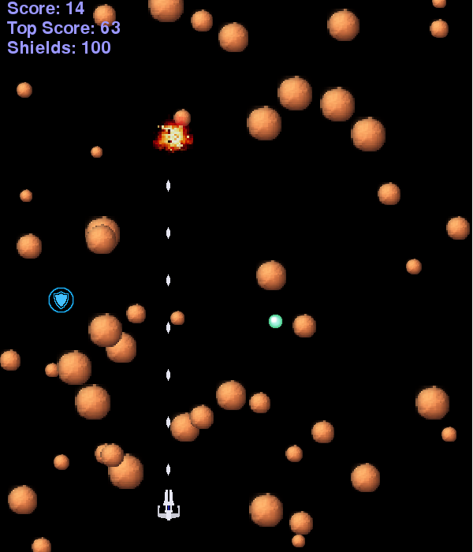

# space-ranger
Vertical scrolling shooter with a space theme. Uses pygame.

## Install
Clone this repository using git or download and unzip

## Requirements
This program was devoloped using Python version 2.7.8 and [pygame](http://www.pygame.org/wiki/about) version 1.9.1. However, it might run using other versions of Python or pygame.

You will definitely need a copy of pygame installed along with its prerequisites. See [pygame.org](http://www.pygame.org).

## To Run the Game
Change directory into your main space-ranger folder:

`cd ./space-ranger/`

Launch the start_game.py script with Python:

`python start_game.py`

## About the Game
This game has six progressively more difficult levels. Evade asteroids as long as you can. Collect the greenish gems to increase your score. Shield powerups will replenish some of your spaceship's shields. Your highest score achieved is tracked, but this does not persist from one program session to the next.

Steer with the direction keys, WADS, or the mouse. Select from two types of weapons using the 1 and 2 keys. The escape key exits the program. 

## License
Copyright 2015 Michael Stockman. Some rights reserved.

The code portion of space-ranger is licensed under a [Creative Commons Attribution-Noncommercial-Share Alike 4.0 United States
License](http://creativecommons.org/licenses/by-nc-sa/4.0/). The Python code is a derived work based on the doger.py project found in "[Invent with Python](http://inventwithpython.com/)" by Albert Sweigart. This work is not endorsed by the original licensor.

See [LICENSE](./LICENSE.md) for details.
